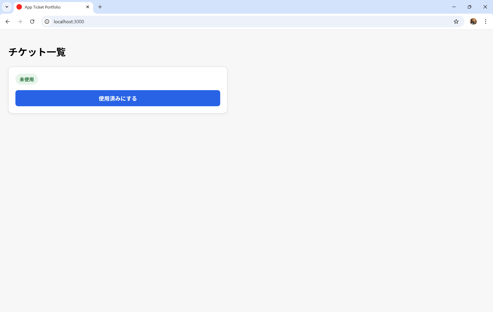
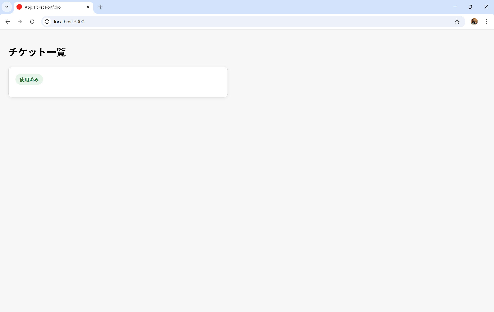
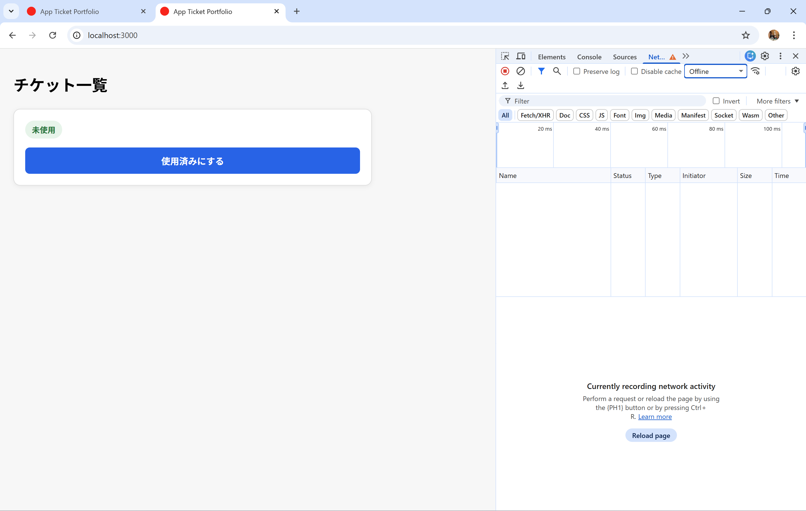
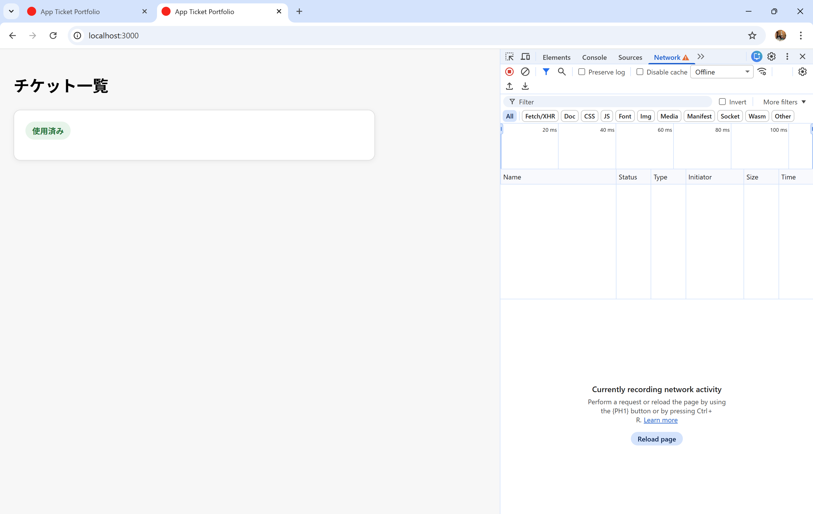
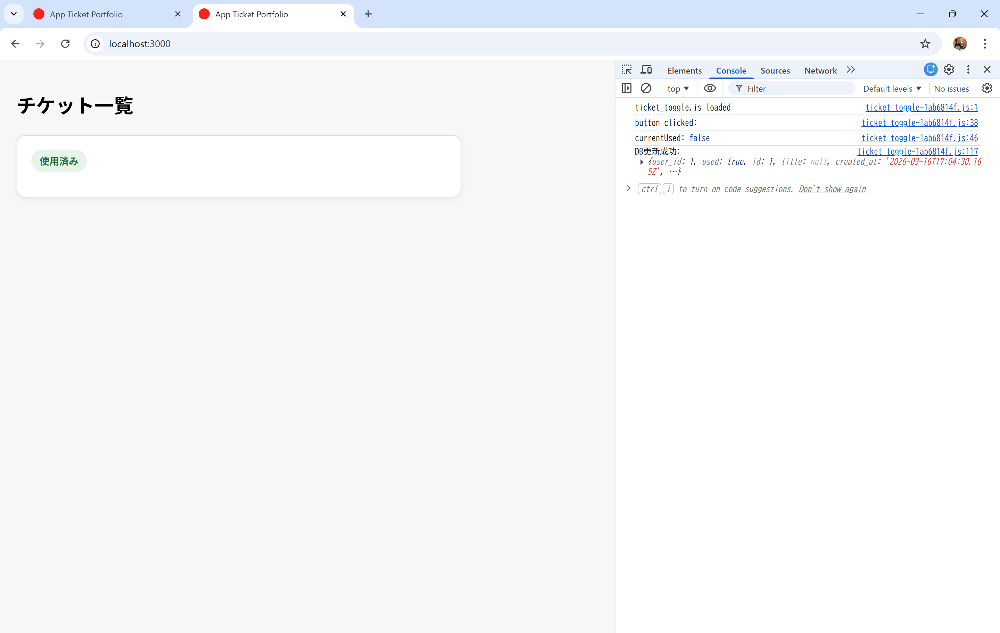
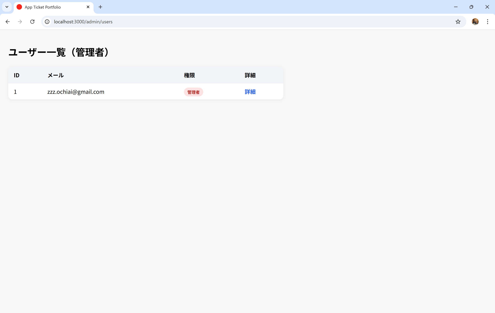
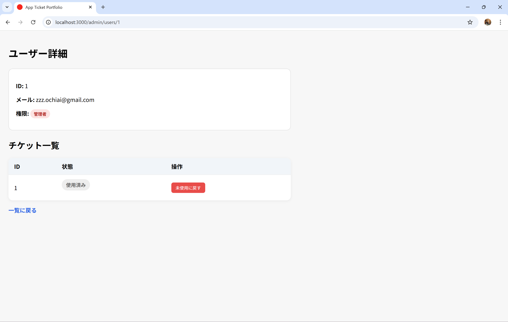
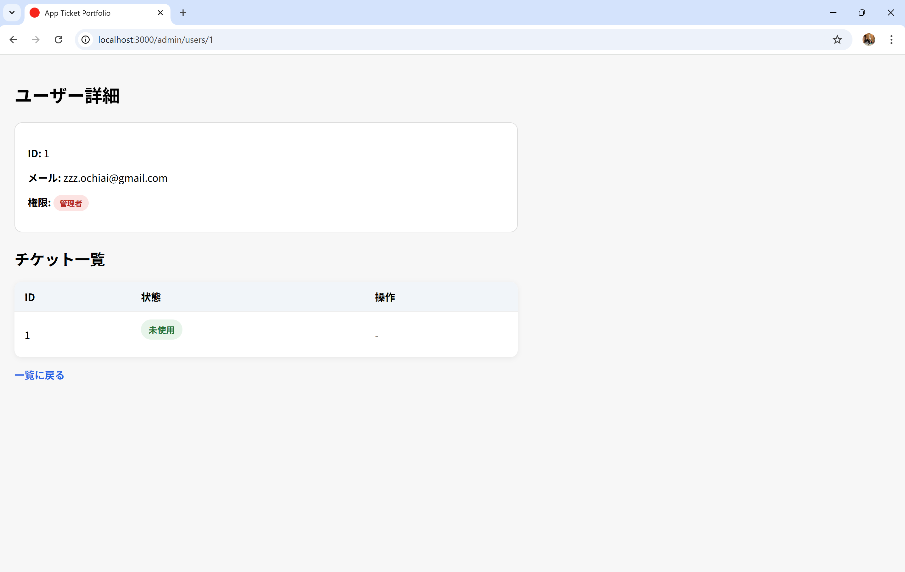

 # Offline Sync Ticket App 
 
 ## 概要 
 
 Offline Sync Ticket App は、オフライン環境でもチケット状態を管理できるチケット管理アプリです。 
 通信が不安定な環境でもチケットを「使用済み」に変更できるよう、LocalStorage を利用した一時保存機能を実装しています。
 また、オンライン復帰時には自動的にサーバーとの同期を行い、Admin による状態変更との競合にも対応しています。 
 権限制御として、一般ユーザーは「未使用」→「使用済み」のみ変更可能とし、Admin はチケット作成・削除・双方向の状態変更を行える設計としています。
 
 ## 作成背景 / 課題意識 
 
 チケット管理システムでは、イベント会場など通信環境が不安定な場所で利用されるケースが想定されます。 
 しかし通常の Web アプリケーションでは、オフライン状態になるとサーバーへ状態変更を送信できず、チケット管理を継続できないという課題があります。 
 本アプリではこの問題に対し、LocalStorage を利用したクライアント側の一時保存機能を実装し、オンライン復帰時に自動同期を行う設計を採用しました。 
 また、チケット状態をユーザーが自由に変更できる設計では不正利用のリスクが発生するため、

 - 一般ユーザー：
   - 「未使用」→「使用済み」のみ変更可能

 - Admin：
   - チケット作成
   - チケット削除
   - 「未使用」⇄「使用済み」の双方向変更

という権限制御を実装しています。 
 
 さらに、オフライン中の変更と Admin 側の変更が競合するケースを考慮し、updated_at を利用した状態競合制御を行っています。

 ## 主な機能 
 
 ### ユーザー機能 

 - チケット一覧表示 
 - チケット状態変更 
 
 ### Admin機能

 - Admin専用アカウント登録 / ログイン
 - ユーザー一覧表示
 - ユーザーごとのチケット管理
 - チケット新規作成
 - チケット削除
 - チケット状態変更（未使用 ⇄ 使用済み）
 
 ### オフライン機能 
 
 - LocalStorage を利用した一時保存 
 - オンライン復帰時の自動同期 
 - 状態競合制御 
 
 ## 画面イメージ 
 
 ### ユーザー画面 
 
 

 
 
 

 

 

 ### Admin画面

 

 

 

## 使用技術

### Backend
- Ruby 3.4.5
- Ruby on Rails 8

### Frontend
- JavaScript
- HTML / CSS
- Turbo
- Importmap

### Database
- SQLite3

### Authentication
- Devise

### Offline Sync
- LocalStorage

### Development Environment
- WSL2
- VSCode

### Version Control
- Git / GitHub

## アプリ構成 / 設計

本アプリでは、「オフライン環境でもチケット状態を安全に管理できること」を主な設計目的としています。
通常の Web アプリケーションでは、状態変更時にサーバー通信が必須となるため、通信切断時には操作自体を継続できないという問題があります。
本アプリではこの問題に対し、クライアント側で即座に UI を更新し、変更内容を LocalStorage に一時保存する構成を採用しました。
オフライン中に行われた変更は pending データとして保持され、オンライン復帰時に自動的にサーバーへ再送されます。
また、状態管理においては Server(DB) を最終的な正規データ（source of truth）として扱い、クライアント側の LocalStorage は一時的な同期キューとして利用しています。
さらに、オフライン中の変更と Admin 側での変更が競合するケースを考慮し、updated_at を利用した状態競合制御を実装しています。
これにより、古い状態による上書きを防止し、Admin 側の操作を優先できる構成としています。

権限制御については、

- 一般ユーザー：
  - 「未使用」→「使用済み」のみ変更可能
- Admin：
  - チケット作成
  - チケット削除
  - 「未使用」⇄「使用済み」の双方向変更

という役割分離を行い、不正利用リスクを抑制しています。
また、認証については User と Admin を別認証として実装しています。

- User：チケット利用者
- Admin：管理者

両者は別テーブルで管理しており、

- User → users テーブル
- Admin → admins テーブル

という構成を採用しています。

これにより、管理者権限を一般ユーザーから分離し、
認証・権限制御を明確化しています。

## 今後の改善

### 実運用を想定した拡張

- チケット一覧の検索・絞り込み機能
- チケット一覧のページネーション対応
- チケットの一括作成・一括付与機能
- 複数スタッフでの同時運用を想定した操作履歴の記録

### 技術的な拡張

- LocalStorage から IndexedDB へ移行し、複数件の未同期データをより安定して管理する
- Background Sync を導入し、オンライン復帰時の同期処理をブラウザ側で補助する
- Service Worker を導入し、オフライン時の画面表示やキャッシュ制御を強化する
- WebSocket / ActionCable を導入し、Admin 側の変更をユーザー画面へリアルタイム反映する
- 状態変更履歴テーブルを追加し、誰が・いつ・どのチケット状態を変更したか追跡できるようにする
- RSpec を導入し、権限制御・同期処理・競合制御のテストを追加する

## セットアップ方法

```bash
git clone git@github.com:zzz-ochiai/app_ticket_portfolio.git
cd app_ticket_portfolio
bundle install
bin/rails db:create
bin/rails db:migrate
bin/rails server
```

## ER図

```text
User
├── id
├── email
├── encrypted_password
├── created_at
└── updated_at

Admin
├── id
├── email
├── encrypted_password
├── created_at
└── updated_at

Ticket
├── id
├── user_id
├── title
├── used
├── created_at
└── updated_at
```

## リレーション

```text
User 1 ─── * Ticket

Admin（独立認証）
```